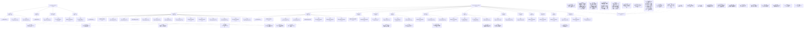

# 证据图

> 由 `metarsi.py` 从 `metarsi.db` 生成，每次写入后重写。不要手改；改记录请用命令。

```mermaid
graph TD
    W0["dev_20250303_20260126<br/>consumed"]
    W0 --> F1["in-list-filter/S<br/>已比较 133 条"]
    W0 --> F2["in-list-filter/R<br/>已比较 11 条"]
    W0 --> F3["s20-model-audit<br/>已比较 4 条"]
    W0 --> F4["s20-model<br/>已比较 2 条"]
    W5["confirm_20260127_20260805<br/>consumed"]
    W5 --> F6["in-list-filter/S<br/>已比较 148 条"]
    W5 --> F7["in-list-filter/R<br/>已比较 22 条"]
    W5 --> F8["list-turnover/S<br/>已比较 2 条"]
    W5 --> F9["s20-model-audit<br/>已比较 1 条"]
    W5 --> F10["s20-model<br/>已比较 3 条"]
    W5 --> F11["model-routing<br/>已比较 5 条"]
    W5 --> F12["day-gate<br/>已比较 61 条"]
    W5 --> F13["pump-model<br/>已比较 4 条"]
    W5 --> F14["mean-reversion<br/>已比较 3 条"]
    W5 --> F15["intraday<br/>已比较 32 条"]
    W5 --> F16["external-factors<br/>已比较 42 条"]
    W5 --> F17["risk-flag<br/>已比较 1 条"]
    W5 --> F18["list-combination<br/>已比较 10 条"]
    W19["reserved_20260806_plus<br/>reserved"]
    F1 --> T20["T0001 atr10/S<br/>in_sample pass t=+4.58"]
    F6 --> T21["T0002 atr10/S<br/>holdout_once fail t=+0.87"]
    F2 --> T22["T0003 atr10/R<br/>in_sample pass t=+4.95"]
    F7 --> T23["T0004 atr10/R<br/>holdout_once fail t=+0.14"]
    F6 --> T24["T0005 rank_atr10/S<br/>in_sample inconclusive t=+2.00"]
    F7 --> T25["T0006 rank_atr10/R<br/>in_sample inconclusive t=+2.33"]
    F6 --> T26["T0007 r5s5_cross_model10/S<br/>reused_holdout fail t=-1.09"]
    F7 --> T27["T0008 r5s5_cross_model10/R<br/>reused_holdout fail t=+0.79"]
    F6 --> T28["T0009 up10_positive_screen/S<br/>reused_holdout fail t=-0.73"]
    F7 --> T29["T0010 up10_positive_screen/R<br/>reused_holdout fail t=-0.21"]
    F6 --> T30["T0011 top50_to_20_atr/S<br/>reused_holdout fail t=-1.51"]
    F7 --> T31["T0012 top50_to_20_atr/R<br/>reused_holdout fail t=-0.17"]
    F8 --> T32["T0013 hold_zone_top50/S<br/>holdout_once inconclusive t=+0.31"]
    F8 --> T33["T0014 swap_when_dropped_past5…<br/>reused_holdout inconclusive t=-0.71"]
    F1 --> T34["T0015 frozen_natr_cut_vs_raw_…<br/>in_sample pass t=+5.80"]
    F6 --> T35["T0016 frozen_natr_cut_vs_raw_…<br/>reused_holdout fail t=-0.43"]
    F6 --> T36["T0017 second_cut_low_natr_50t…<br/>reused_holdout fail t=-1.08"]
    F6 --> T37["T0018 second_cut_low_turnover…<br/>reused_holdout fail t=-0.98"]
    F6 --> T38["T0019 second_cut_main_money_o…<br/>reused_holdout fail t=-2.16"]
    F6 --> T39["T0020 frozen_first10_places/S<br/>in_sample inconclusive t=+1.94"]
    F6 --> T40["T0021 frozen_stayers_vs_new/S<br/>in_sample inconclusive t=+1.67"]
    F6 --> T41["T0022 second_cut_dn7_model_50…<br/>reused_holdout fail t=-1.18"]
    F1 --> T42["T0023 ma20_rising_first50to20…<br/>reused_holdout fail t=-2.49"]
    F6 --> T43["T0024 ma20_rising_first50to20…<br/>reused_holdout fail t=+0.95"]
    F6 --> T44["T0025 ma20_and_ma99_rising_fi…<br/>in_sample inconclusive t=+2.52"]
    F6 --> T45["T0026 macd_golden_age_11_20_f…<br/>reused_holdout fail t=-0.30"]
    F3 --> T46["T0028 frozen_model_vs_fold_mo…<br/>holdout_once inconclusive"]
    F3 --> T47["T0029 frozen_model_offensive_…<br/>reused_holdout inconclusive"]
    F9 --> T48["T0030 frozen_model_safe_list/…<br/>holdout_once fail"]
    F4 --> T49["T0031 unified_v1_offensive_mi…<br/>holdout_once inconclusive t=+0.72"]
    F10 --> T50["T0032 unified_v1_offensive_mi…<br/>holdout_once fail t=-1.61"]
    F10 --> T51["T0033 unified_v1_safe_minus_f…<br/>reused_holdout inconclusive t=+1.41"]
    F4 --> T52["T0034 unified_v2_offensive_mi…<br/>reused_holdout inconclusive t=+1.71"]
    F10 --> T53["T0035 unified_v2_offensive_mi…<br/>reused_holdout fail t=-1.88"]
    F11 --> T54["T0036 R1_index_up_phase_froze…<br/>holdout_once inconclusive t=+1.01"]
    F11 --> T55["T0037 R2_breadth_ge_50_frozen…<br/>reused_holdout fail t=-0.36"]
    F11 --> T56["T0038 R3_sector_leader_persis…<br/>reused_holdout fail t=-1.01"]
    F12 --> T57["T0039 style_gate_cyb_minus_hs…<br/>holdout_once inconclusive t=+3.82"]
    F12 --> T58["T0040 sector_structure_synerg…<br/>reused_holdout inconclusive t=+1.35"]
    F12 --> T59["T0041 stack_style_gate_plus_c…<br/>reused_holdout inconclusive t=+2.05"]
    F12 --> T60["T0042 trailing_matured_up_sto…<br/>reused_holdout fail t=+0.00"]
    F7 --> T61["T0043 pump_ratio_bands_r20_po…<br/>in_sample inconclusive t=+0.00"]
    F7 --> T62["T0044 s20_pump_up_and_ratio_c…<br/>reused_holdout inconclusive t=+2.45"]
    F7 --> T63["T0045 S0014_pump_up_lowest_th…<br/>reused_holdout inconclusive t=+1.12"]
    F13 --> T64["T0046 pump_v5_shape_and_v5b<br/>holdout_once fail t=+0.00"]
    F14 --> T65["T0047 ma120_oversold_reversion<br/>holdout_once fail t=-4.50"]
    F13 --> T66["T0048 pump_v6_phase_checkpoin…<br/>reused_holdout fail t=+0.00"]
    F15 --> T67["T0049 intraday_16_features_s20<br/>holdout_once inconclusive t=+3.90"]
    F16 --> T68["T0050 semas_21_factors_s20<br/>holdout_once inconclusive t=-4.00"]
    F17 --> T69["T0051 S0016_risk_score_half_s…<br/>holdout_once inconclusive t=+4.50"]
    F18 --> T70["T0052 s20_plus_pool_a_merge<br/>holdout_once fail t=-2.40"]
    F18 --> T71["T0053 nested_A_r20top100_by_s…<br/>in_sample inconclusive t=+0.90"]
    F18 --> T72["T0054 nested_B_s20top100_by_r…<br/>in_sample fail t=-5.70"]
    S73["S0001 影子<br/>第5日收盘时前5日跌=5%且仍持仓的，不再算作继续…<br/>未结"] -.-> W19
    S74["S0002 影子<br/>每日进攻版Top20里去掉当天跌启动分处于全市场最…<br/>已结 用户 2026-10-06 淘汰：依据只在开发期（ATR/跌启动类否决在确认期 t 0.1~0.9），名额让给风格门；未读保留窗口"] -.-> W19
    S75["S0003 影子<br/>名单20只不减，名单内按名次分位加ATR分位排序<br/>已结 用户 2026-10-06 淘汰：依据最弱（确认期为正、开发期为零、账户口径看不出），名额让给风格门；未读保留窗口"] -.-> W19
    S76["S0004 影子<br/>持仓掉出前50名时换成当天名单最靠前的未持有名字，…<br/>已结 用户 2026-10-05 淘汰：依据最弱（确认期同日配对差 -0.41，t -0.7），名额让给盘面感知规则；未读保留窗口"] -.-> W19
    S77["S0005 影子<br/>S20 进攻版漏斗只改一个参数：stage1 前 …<br/>已结 用户 2026-10-08 结掉，名额让给合成风险分：S0005 为风控型，收益中性（每笔 -0.12），与风险分作用重叠；未读保留窗口"] -.-> W19
    S78["S0007 影子<br/>盘面感知三态路由（信号日收盘后决定当天用哪张名单，…<br/>未结"] -.-> W19
    S79["S0010 影子（主）<br/>风格门：信号日收盘，创业板指(399006.SZ)…<br/>未结"] -.-> W19
    S80["S0012 影子<br/>pump 比值剔除：每个信号日，冻结合约 conf…<br/>已结 用户 2026-10-06 替换为 P(涨) 规则：S20 幸存者上 ratio>5 段 pump 验证期 +3.43、样本外 -3.08 前后反号，对冻结同日差 0.00，126 天仅 35 天起作用（T0044）；只读了信号日 pump 分，未读保留窗口结果"] -.-> W19
    S81["S0014 影子<br/>pump 上涨启动子筛选：每个信号日，冻结合约 c…<br/>未结"] -.-> W19
    S82["S0016 影子<br/>合成风险分（仓位层，名单不变）：每个信号日，在冻结…<br/>未结"] -.-> W19
    N83["N0001 否决<br/>用 R5/S5 模型做正向(5日碰+10%)与负向…"]
    T26 -.-> N83
    T27 -.-> N83
    N84["N0002 否决<br/>按 5 日内碰 +10% 的概率做正向筛选"]
    T28 -.-> N84
    T29 -.-> N84
    N85["N0003 否决<br/>从第 21-50 名(或 21-40 名)里选进 …"]
    T30 -.-> N85
    T31 -.-> N85
    N86["N0004 否决<br/>把「前20去掉ATR最高的10只」用于名单"]
    T20 -.-> N86
    T21 -.-> N86
    T22 -.-> N86
    T23 -.-> N86
    N87["N0005 否决<br/>把名单减到 10 只"]
    N88["N0006 否决<br/>持仓掉出前 20 就卖出换新进的"]
    N89["N0007 否决<br/>把 adx 当模型特征"]
    N90["N0008 否决<br/>在冻结的 S20 进攻版上再剪第二刀（NATR、换…"]
    T36 -.-> N90
    T37 -.-> N90
    T38 -.-> N90
    N91["N0009 否决<br/>按均线方向（MA10/20/30/60/99，单条…"]
    T42 -.-> N91
    T43 -.-> N91
    T44 -.-> N91
    T45 -.-> N91
    N92["N0010 否决<br/>把开发期（2025-03～2026-01）的 S2…"]
    T46 -.-> N92
    N93["N0011 否决<br/>用统一做法 v1（单模型、扩展窗口、固定300棵树…"]
    T50 -.-> N93
    N94["N0012 否决<br/>用统一做法 v2（按日排序 LambdaRank、…"]
    T53 -.-> N94
    N95["N0013 否决<br/>按市场广度（MA20向上占比）或按板块领涨持续性来…"]
    T55 -.-> N95
    T56 -.-> N95
    N96["N0014 否决<br/>名单内按个股所属行业的 20 日强弱或行业 MA2…"]
    N97["N0015 否决<br/>在名单内按个股所属板块是否为当天领涨类别做倾斜（加…"]
    N98["N0016 否决<br/>用板块间协同/抵消（抱团度、成长与周期/防御的20…"]
    N99["N0017 否决<br/>用名单的到位股数/先止损股数比值（ratio2）做…"]
    T60 -.-> N99
    N100["N0018 否决<br/>用 K 线技术/形态特征训练方法 C（ATR 单位…"]
    T64 -.-> N100
    N101["N0019 否决<br/>用超买度（离120日线、RSI24）作为 S20 …"]
    N102["N0020 否决<br/>远低于向上的120日线且RSI超卖（或RSI回升过…"]
    N103["N0021 否决<br/>用 v6（入场后路径+背景模型）给 S20 持仓加…"]
    N104["N0022 否决<br/>分钟级干净度/60分钟RSI/涨跌量比/低点抬高/…"]
    N105["N0023 否决<br/>SEMAS 5 日清单中除以 total_mv 的…"]
    N106["N0024 否决<br/>S20 进攻版与 R20 池 A 合并（并集或资金…"]
    T70 -.-> N106
    N107["N0025 否决<br/>S20 前 100 内改按 R20 r20_pre…"]
```
