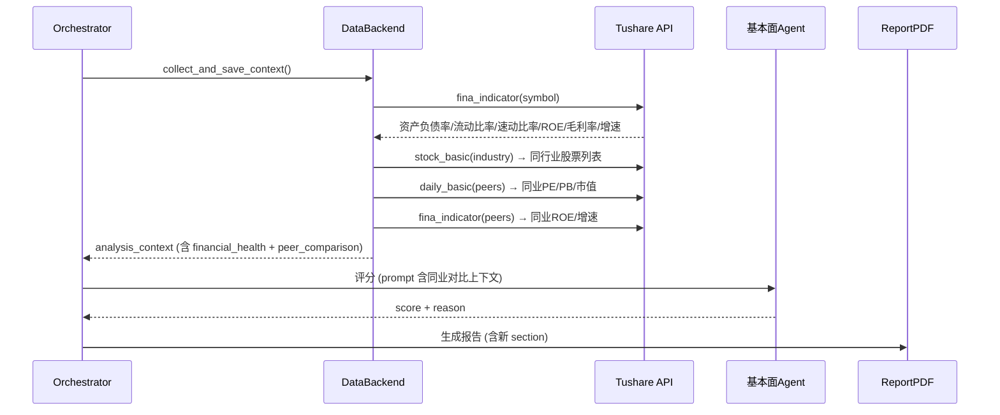
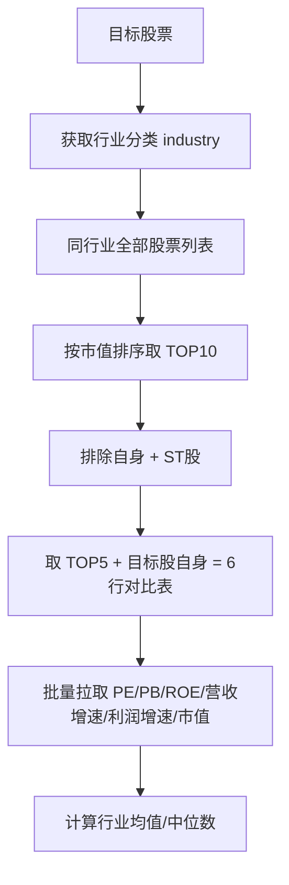

# Proposal: 基本面增强 — 财务健康 + 成长性 + 同业对比

**日期**: 2026-03-22
**版本**: v1.0
**分支**: 待创建 `feat/fundamental-enhancement`
**状态**: 已确认，待实现

---

## 1. 现状是什么

当前基本面估值 Agent（`fundamental_agent`）的数据上下文仅包含：

- PE(TTM)、PB、总市值
- 收盘价、涨跌幅
- 换手率

**问题**：

- **孤立评估**：PE=55 是高还是低？没有行业参照系，只能靠绝对值硬编码区间判断（如 PE>50="高估"）。实际上电气设备行业均值可能是 72，55 反而是"相对低估"。
- **财务盲区**：完全缺失偿债能力指标（资产负债率、流动比率、速动比率）。一家高增长但资产负债率 71% 的公司，和一家低增长但财务稳健的公司，当前评分无法区分。
- **成长性缺失**：没有营收/利润 YoY 增速。无法判断"低估值是因为没增长"还是"被市场错杀"。
- **机构态度不明**：缺少基金持股、股东户数变化等筹码数据。

## 2. 要达到什么效果

分析报告中新增以下内容，让基本面评估从"孤立打分"变成"相对估值"：

### 2.1 数据层新增

| 数据项 | 来源 | 用途 |
|--------|------|------|
| 资产负债率 | Tushare `fina_indicator` | 偿债风险 |
| 流动比率 | Tushare `fina_indicator` | 短期偿债能力 |
| 速动比率 | Tushare `fina_indicator` | 扣除存货的偿债能力 |
| 营收 YoY 增速 | Tushare `fina_indicator` / `income` | 成长性 |
| 净利润 YoY 增速 | Tushare `fina_indicator` / `income` | 成长性 |
| ROE | Tushare `fina_indicator` | 盈利质量 |
| 毛利率 | Tushare `fina_indicator` | 盈利能力 |
| 同行业 TOP5 公司关键指标 | Tushare `stock_basic` + `daily_basic` + `fina_indicator` | 横向对比锚定 |
| 基金持股比例（可选） | Tushare `fund_portfolio` | 机构态度 |

### 2.2 Agent 评分增强

基本面 Agent 的 prompt 上下文新增：
- 财务健康三指标 + 安全线标注
- 成长性指标 + 行业均值对比
- 同业 5-6 家公司的对比表

Agent 基于相对估值给分，而非仅看绝对值。

### 2.3 报告新增 Section

- **财务健康度表格**：资产负债率/流动比率/速动比率 + 安全线对比
- **成长性表格**：营收/利润增速 + 行业对比
- **同业估值对比表**：PE/PB/ROE/市值横向比较

### 2.4 本地评分公式增强

`_simple_policy()` 中基本面公式新增：
- 资产负债率惩罚（>70% 扣分）
- 流动比率惩罚（<1.5 扣分）
- 成长性加分（利润增速 >30% 加分）
- ROE 加分（>15% 加分）

## 3. 核心设计

### 3.1 数据流

### 3.2 同业对比筛选逻辑

## 4. 关键约束/决策

### 4.1 数据源约束

- Tushare `fina_indicator` 有**限频**（每分钟 200 次）。同业对比需要拉 5-6 家公司数据，需要控制请求频率。
- 财务数据是**季报频率**，不是实时的。使用最新一期财报数据即可。
- 部分新股/北交所股票可能缺少财务数据，需要做好降级处理（缺失时跳过，不影响评分）。

### 4.2 不新增 Agent

财务健康、成长性、同业对比都属于基本面分析范畴，**不新增 Agent**，而是增强现有 `fundamental_agent` 的数据上下文和评分公式。保持 12 Agent 架构不变。

### 4.3 同业数据缓存

同一行业的对比数据在同一天内不会变化。如果批量分析同行业多只股票，应缓存同业数据避免重复请求。缓存粒度：`{industry}_{date}.json`。

### 4.4 受影响文件

- `src/stockagent_analysis/data_backend.py` — 新增数据拉取方法
- `src/stockagent_analysis/agents.py` — 基本面 Agent 的 `_simple_policy()` 公式增强
- `src/stockagent_analysis/report_pdf.py` — 新增报告 section
- `configs/agents_v2/fundamental_agent.json` — prompt 模板可能调整

### 4.5 不做的事

- 不做机构持股数据（Tushare `fund_portfolio` 需要更高权限，且数据滞后 1 个季度，性价比低）
- 不做多时间框架策略拆分（短线/中线/长线分别建议）— 这是辩论模块的增强，不属于本 Proposal 范围
- 不做结构化风险矩阵 — 当前辩论风险评估已覆盖

---

## 5. 决策记录（2026-03-22 确认）

| 决策点 | 结论 |
|--------|------|
| 同业对比数量 | **TOP 5 家**（按市值排序，排除自身+ST） |
| 基本面权重 | **维持 10% 不变**，内部重新分配（原 PE/PB 子项压缩，腾出空间给财务健康+成长性） |
| 同业缓存目录 | **`output/cache/industry/{industry}_{date}.json`** |
